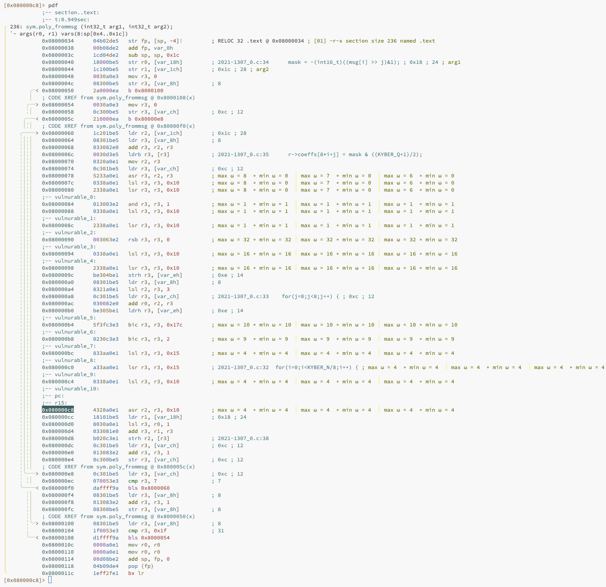

# Towards Automated Detection of Single-Trace Side-Channel Vulnerabilities in Constant-Time Cryptographic Code

## Authors

[Ferhat Erata](https://ferhat.ai) (Yale), Ruzica Piskac (Yale), Victor Mateu (TII), Jakub Szefer (Yale)

## Abstract

Although cryptographic algorithms may be mathematically secure, implementations can leak secret information. Timing and power side-channel vulnerabilities are significant threats to these implementations. While constant-time coding mitigates timing vulnerabilities, power side-channels remain exploitable. Detecting such vulnerabilities is challenging, requiring assembly-level code analysis and understanding which instructions might leak information based on their operands and values.

To assist cryptographers, we present **Pascal**: Power Analysis Side Channel Attack Locator. Pascal introduces novel symbolic register analysis techniques for binary analysis of constant-time cryptographic algorithms, accurately identifying potential power side-channel vulnerabilities. Evaluated on various post-quantum cryptographic algorithm implementations, Pascal automatically detected numerous previously reported single-trace power side-channel vulnerabilities.

## Keywords

Power Side-Channels, Hamming Weight, Differential Program Analysis, Post-Quantum Cryptography, Symbolic Execution, Relational Program Analysis, Binary Analysis, Constant-Time Cryptography

## Resources

- **Conference:** European Symposium on Security and Privacy (EuroS&P)
- **DOI:** [10.1109/EuroSP57164.2023.00047](https://doi.ieeecomputersociety.org/10.1109/EuroSP57164.2023.00047)
- [**EuroS&P Pascal Slides**](https://eurosp2023.ieee-security.org/slides/EuroSP-Pascal-Slides.pdf)
- [**YouTube**](https://youtu.be/1w_jSuvThD4)
- [**Bibtex**](https://ferhat.ai/publication/erata-2023-towards/cite.bib)

## Example Script for Analyzing Vulnerabilities

Below is a Python script using Pascal to detect vulnerabilities in cryptographic code. The example analyzes the `poly_frommsg` benchmark in `benchmarks/17/2021-1307_0.o`. First compile the code using the following or a similar command:

```bash
arm-none-eabi-gcc -Wall -ggdb 2021-1307_0.c -c
```


### Analyzed Code: `poly_frommsg.c`

```c
#include <stdint.h>
#define KYBER_POLYBYTES	384
#define KYBER_N 256
#define KYBER_INDCPA_MSGBYTES 32
#define KYBER_Q 3329

/*
 * Elements of R_q = Z_q[X]/(X^n + 1). Represents polynomial
 * coeffs[0] + X*coeffs[1] + X^2*xoeffs[2] + ... + X^{n-1}*coeffs[n-1]
 */
typedef struct {
  int16_t coeffs[KYBER_N];
} poly;

/*************************************************
* Name:        poly_frommsg
*
* Description: Convert 32-byte message to polynomial
*
* Arguments:   - poly *r:            pointer to output polynomial
*              - const uint8_t *msg: pointer to input message
**************************************************/
void poly_frommsg(poly *r, const uint8_t msg[KYBER_INDCPA_MSGBYTES])
{
  unsigned int i,j;
  int16_t mask;

#if (KYBER_INDCPA_MSGBYTES != KYBER_N/8)
#error "KYBER_INDCPA_MSGBYTES must be equal to KYBER_N/8 bytes!"
#endif

  for(i=0;i<KYBER_N/8;i++) {
    for(j=0;j<8;j++) {
      mask = -(int16_t)((msg[i] >> j)&1);
      r->coeffs[8*i+j] = mask & ((KYBER_Q+1)/2);
    }
  }
}
```

### Python Script

```python
import angr
import claripy
from taint import Sensitive
import sca
import pascal

import logging
logging.getLogger(name='sca').setLevel(logging.INFO)


base_addr = 0x08000034
folder_name = './benchmarks/17/'
file_name = '2021-1307_0.o'
proj = angr.Project(folder_name + file_name,
                    load_options={"auto_load_libs": False, 'main_opts': {'base_addr': base_addr}})
func_name = 'poly_frommsg'
prototype = angr.types.parse_defns(
    'void poly_frommsg(struct poly {char coeffs[256]; }* r, const uint8_t *msg);')[func_name]
print(prototype)

coeffs = [claripy.BVS('coeff!{}'.format(i), 16, explicit_name=True) for i in range(256)]
coeffs_symbolic = claripy.Concat(*coeffs)

msg = [claripy.BVS('msg!{}'.format(i), 8, explicit_name=True).annotate(Sensitive()) for i in range(32)]
msg_symbolic = claripy.Concat(*msg)

addr = sca.getAddressOfSymbol(proj, func_name)
state: angr.SimState = proj.factory.call_state(addr,
                                               angr.PointerWrapper(coeffs_symbolic, buffer=True),
                                               angr.PointerWrapper(msg_symbolic, buffer=True),
                                               prototype=prototype)

simgr = proj.factory.simgr(state)

simgr.use_technique(angr.exploration_techniques.LoopSeer(cfg=cfg, bound=2))

psca: sca.PowerSideChannelAnalysis = proj.analyses.PowerSideChannelAnalysis(model=pascal.HammingWeight.basic)

psca.arm(state)
vulnerabilities = psca.analyze(simgr)

sca.goto_vulnurablities(base_addr=base_addr, folder_name=folder_name, file_name=file_name,
                        func_name=func_name, vulnurebilities=vulnerabilities)

```

Run the script, first go to root directory of pascal and run the script:

```bash
python benchmarks/17/2021-1307_0.py
```

### Available Methods for Analysis

You can choose one of the following methods for analysis:

- Hamming Weight:
  - `pascal.HammingWeight.basic`
  - `pascal.HammingWeight.symba`
  - `pascal.HammingWeight.obvbs`

- Hamming Distance:
  - `pascal.HammingDistance.basic`
  - `pascal.HammingDistance.symba`
  - `pascal.HammingDistance.obvbs`

- Omega Class Sampling:
  - `pascal.OmegaClassSampling.z3_basic`
  - `pascal.OmegaClassSampling.z3_bp`
  - `pascal.OmegaClassSampling.cvc5_inc`

### Output in radere2

```bash
cd ~/pascal/benchmarks/17
r2 2021-1307_0.o
```

Accept loading the script that is automatically generated by Pascal (`2021-1307_0.o.r2`)

The output should be similar to the following:



To show the comments in radare2, on the right side of the screen, type the following commands:

```ruby
e asm.cmt.col = 65
e asm.cmt.right = true
e asm.cmt.wrap = false
```

## Docker Installation Instructions

To build and run the Pascal tool using Docker, follow these steps:

1. **Build the Docker Image:**

   ```sh
   docker buildx build -t pascal-tool .
   ```

2. **Run the Docker Container:**

   ```sh
   docker run -it pascal-tool
   ```

3. **Restarting the Docker Container:**

   ```sh
   docker start -i <container_id_or_name>
   ```

## License

This work is licensed under the MIT License.

## Contact

For questions or support, please contact [Ferhat Erata](https://www.linkedin.com/in/ferhaterata/) and [Thanos Typaldos](https://cpsc.yale.edu/people/thanos-typaldos). We are working on a new version of Pascal with more features and improvements, called _Pascal++_ or _Blaise_. If you are interested in contributing to the project, please contact us.
